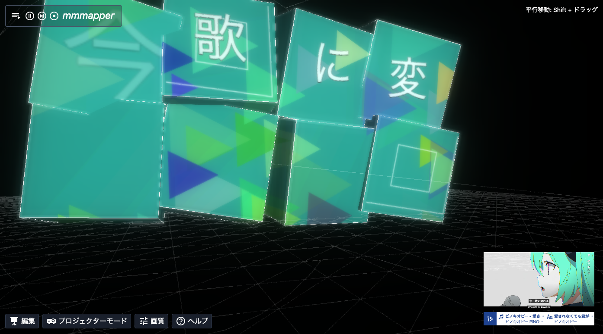
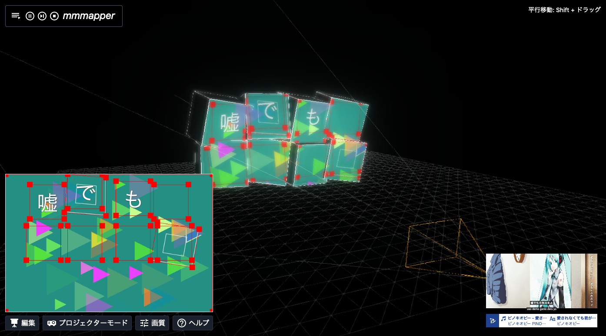

# mmmapper

> A lyric projection mapper for reality and virtuality.

**What is mmmapper?** mmmapper is a projection mapping software that works in combination with TextAlive to create expressions based on music information. It is a "virtual-real hybrid" software, which you can enjoy not only in the virtual space, but also in the real space with a projector.

**mmmapper とは？** mmmapper は TextAlive と連携して音楽情報に基づく表現を行えるプロジェクションマッピングソフトウェアです。
「仮想と現実のハイブリッド」がコンセプトで、仮想空間内でだけでなく、プロジェクターを接続すれば実際に投影して楽しむことができます。

## Contents

- [Demo](#demo)
- [Screenshots](#screenshots)
- [Related](#related)
- [Development](#development)
- [Todo](#todo)
- [License](#license)

## Demo

<https://nolze.github.io/mmmapper/>

## Screenshots





## Related

- [@mmmapper/components](https://github.com/mmmapper/mmmapper-components): A libary of components and elements for mmmapper. (WIP)

## Development

Using [svite](https://github.com/dominikg/svite). Run locally:

```
npm install
npm run dev
```

Build:

```
npm run build -- --base <basepath>
```

## Todo

* [ ] Free screen edit
* [ ] Free stage edit/import
* [ ] I18n
* [ ] Any songs
* [ ] Support other projector aspect ratios

## License

MPL-2.0 (planned). TextAlive App API is licensed under [TextAlive App API License](https://github.com/TextAliveJp/textalive-app-api/blob/master/LICENSE.md).
